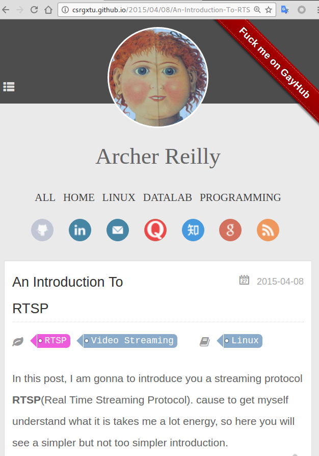

If you familiar with "Fork me on GitHub", then here I use "Fuck me on GayHub", read more to find out how to set it up.
<!--more-->



first, add the CSS ribon cdn to your page's head
```html
<link rel="stylesheet" href="https://cdnjs.cloudflare.com/ajax/libs/github-fork-ribbon-css/0.2.0/gh-fork-ribbon.min.css" />

```

second, add code into your page's body
```html
<a class="github-fork-ribbon" href="http://github.com/csrgxtu" title="Fuck me on GayHub">Fuck me on GayHub</a>

```
